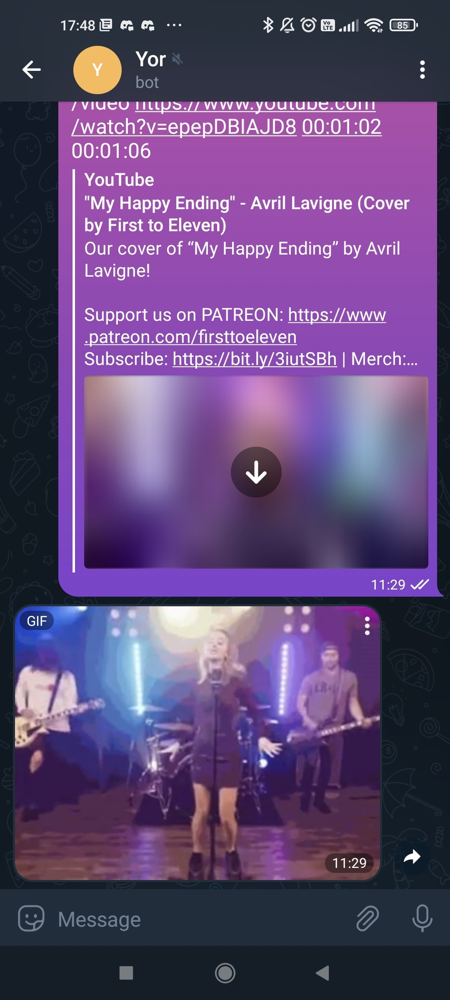
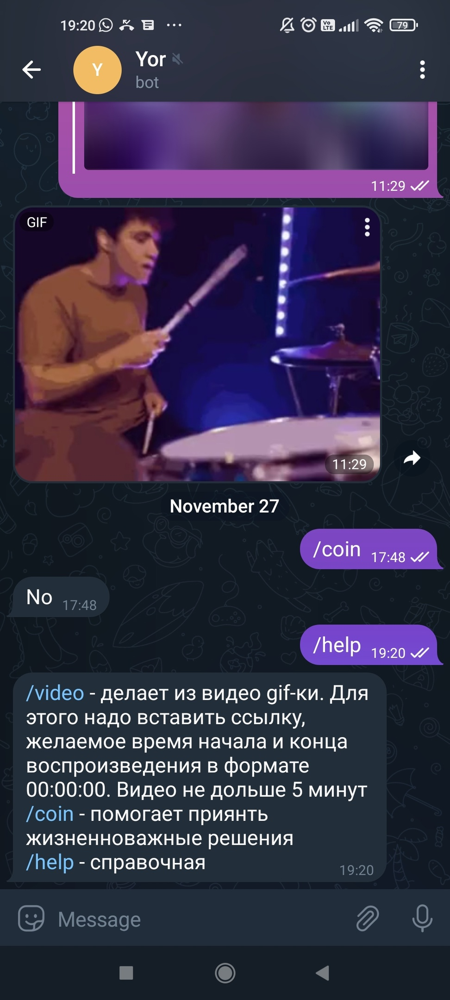

#softEng
___
##How to run 
1. Print in console ./gradlew run (Linux) or gradlew run (Windows), last jar should be intalled and JAVA_HOME set

2. Docker build -t thandriss/yor . and start it with port mapping: docker run -p 80:80 thandriss/yor

---

More information about the functions:
1. /video - for running it is need to give url of youtube video, time of start and end. Duration of gif can not be more than 2 minutes
2. /coin - randomly send "Yes" or "No"
3. /motivation - give some good words
4. /help - all information, what you read here

